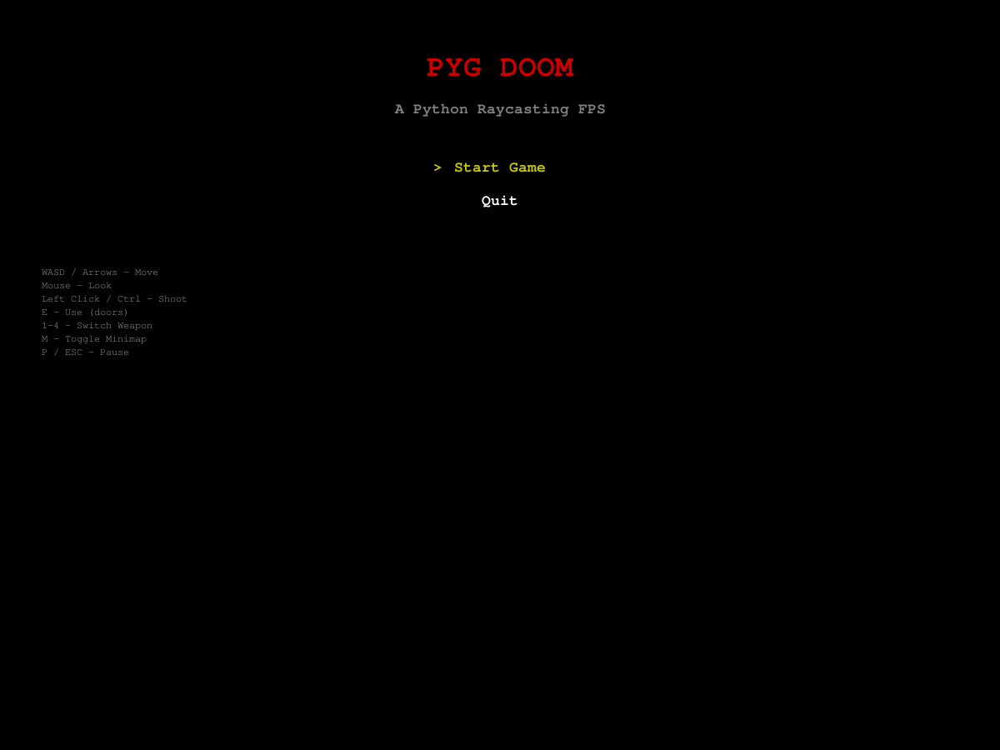
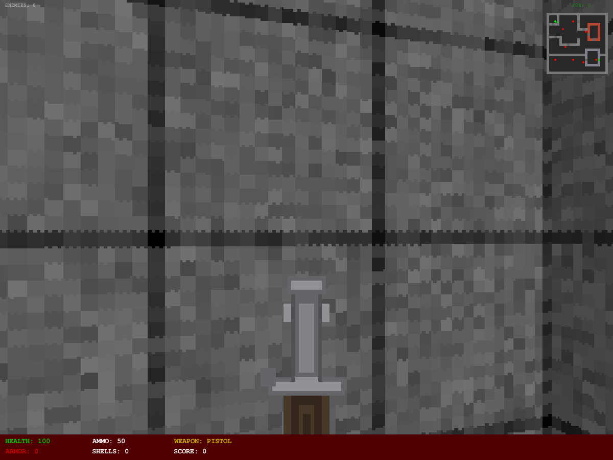
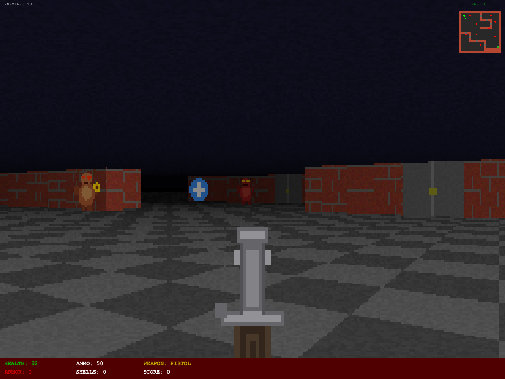

# PYG DOOM

A Doom-style first-person shooter built from scratch in Python using Pygame.

Features a complete raycasting engine with textured walls, floor and ceiling rendering, billboarded sprites with animation, enemy AI with pathfinding, multiple weapons, doors, items, and a 4-level campaign. All assets are procedurally generated at runtime.


## Screenshots

**Title Screen**


**Gameplay — exploring a level with weapon and HUD**


**Combat — enemies in the arena**


## Quick Start

```bash
pip install pygame
python main.py
```

## Controls

| Action | Keys |
|---|---|
| Move forward/back | `W` / `S` or `Up` / `Down` |
| Strafe left/right | `Q` / `E` (or `A` / `D` for turning) |
| Turn left/right | `A` / `D` or `Left` / `Right` |
| Look around | Mouse (captured) |
| Shoot | Left Click or `Left Ctrl` |
| Use (doors) | `E` |
| Switch weapon | `1` Chainsaw, `2` Pistol, `3` Shotgun, `4` Chaingun |
| Toggle minimap | `M` |
| Pause | `Escape` or `P` |
| Restart (on death) | `R` |

## Requirements

- Python 3.10+
- Pygame 2.6+

No other dependencies. All textures, sprites, and sounds are generated procedurally at runtime — no external asset files needed.

## Gameplay

### Levels

| Level | Name | Enemies | Description |
|---|---|---|---|
| E1M1 | Tech Base | 8 | Large map with multiple rooms, doors, and a key hunt |
| E1M2 | Hellish Outpost | 10 | Medium map with tighter corridors and more enemies |
| E1M3 | Fortress of Doom | 9 | Compact arena-style map with boss-tier enemies |
| E1M4 | The Final Challenge | 10 | Puzzle map with key hunts, locked rooms, and final boss |

Clear all enemies in a level and reach the exit tile to advance. Complete all 4 levels to win. Level states (doors, enemies) reset on reload.

### Enemies

| Type | HP | Speed | Attack | Visual |
|---|---|---|---|---|
| **Imp** | 40 | 1.5 | Ranged fireball (8 dmg, range 8) | Brown body, red eyes, horns, fires a glowing fireball |
| **Demon** | 80 | 2.5 | Melee bite (15 dmg, range 1.5) | Large red body, tusks, wide jaw, claw swipe |
| **Baron** | 200 | 1.2 | Ranged blast (20 dmg, range 10) | Massive green body, dark horns, red eyes, green energy |

#### Enemy Animation

Each enemy has 6 sprite states rendered as procedural 64x64 RGBA textures:

| State | Behavior |
|---|---|
| **Idle** | Standing still, body centered |
| **Walk1 / Walk2** | Alternating frames with body offset and leg movement while chasing |
| **Attack** | Ranged enemies show projectile; melee enemies extend claws |
| **Hurt** | White flash overlay when taking damage (0.2s duration) |
| **Dead** | Flattened dark sprite with white flash on death (0.15s) |

Animation is driven by timers in `enemy.update()` — walk frames cycle at 6 Hz during chase, hurt/flash are time-limited.

#### Enemy AI

Enemies use a finite state machine:

- **Idle** — Standing still, waiting to be alerted
- **Chase** — Moving toward player using BFS pathfinding through open doors
- **Attack** — Firing at player (ranged or melee depending on type)
- **Hurt** — Brief stagger on taking damage (0.2s invulnerability)
- **Dead** — Death flash then persistent corpse

Alert triggers when the enemy sees the player via ray-based line-of-sight check within alert range. Enemies re-path every 0.5s using BFS.

### Weapons

| Weapon | Damage | Fire Rate | Ammo | Notes |
|---|---|---|---|---|
| **Chainsaw** | 15 | 0.4s | Infinite | Melee only, high DPS up close |
| **Pistol** | 20 | 0.5s | Bullets | Starting weapon, accurate |
| **Shotgun** | 12 x7 | 0.9s | Shells | Spread shot, devastating at close range |
| **Chaingun** | 12 | 0.12s | Bullets | Rapid fire, moderate damage |

Weapon sprites are pre-built as 64x64 RGBA textures and scaled 2x (128x128 on screen) via mask-based blitting for performance. Muzzle flash overlays appear briefly on fire with animated starburst patterns and weapon recoil.

### Items

| Item | Effect |
|---|---|
| Small Health Pack | +10 HP |
| Large Health Pack | +25 HP |
| Bullet Box | +20 bullets |
| Shell Box | +8 shells |
| Small Armor | +25 armor |
| Large Armor | +50 armor |
| Red Key | Opens red doors |
| Blue Key | Opens blue doors |
| Weapon Pickups | Grants new weapon + starting ammo |

### Doors

- **Standard doors** (`E` to open): Open with animation, block movement when closed
- **Red doors**: Require red key to open
- **Blue doors**: Require red key to open

Doors animate open/closed at 2.0 speed. Open doors become walkable; closed doors block both player and enemies. Door state resets when reloading a level.

### Victory Progression

- **Levels 1-3**: Clear all enemies and reach exit → "LEVEL COMPLETE!" screen → press ENTER for next level
- **Level 4 (Final)**: Clear all enemies and reach exit → "CONGRATULATIONS!" screen with pulsing text → press ENTER or ESC to return to main menu

## Sound Effects

All sounds are procedurally generated using numpy waveforms (sine, square, sawtooth, noise).

### Weapon Sounds

| Sound | Type |
|---|---|
| Pistol | Short noise burst (200Hz, 0.1s) |
| Shotgun | Low noise burst (150Hz, 0.2s) |
| Chaingun | Quick noise snap (250Hz, 0.05s) |
| Chainsaw | Sawtooth growl (100Hz, 0.15s) |

### Enemy Sounds

Each enemy type has 4 unique sounds:

| Event | Imp | Demon | Baron |
|---|---|---|---|
| Alert | Sawtooth 400Hz | Sawtooth 150Hz (deeper) | Sawtooth 100Hz (growl) |
| Pain | Square 500Hz | Square 350Hz | Square 250Hz |
| Death | Descending 600→150Hz | Descending 400→80Hz | Descending 300→50Hz |
| Attack | Noise 300Hz | Noise 120Hz (bite) | Noise 200Hz (blast) |

### Other Sounds

| Sound | Type |
|---|---|
| Player hurt | Square 180Hz |
| Door open | Sawtooth 80Hz (low rumble) |
| Item pickup | Sine 600Hz (ascending) |
| Weapon pickup | Sine 800Hz (bright) |
| No ammo | Square 100Hz (click) |

## Project Structure

```
pyg/
├── main.py              # Entry point
├── game.py              # Main game loop, state management, event handling
├── settings.py          # All constants, weapon/enemy/item definitions
├── player.py            # Player movement, collision, input, health
├── map.py               # 4 level layouts, GameMap class with doors
├── raycaster.py         # DDA raycasting engine with z-buffer
├── renderer.py          # Vectorized floor/ceiling/wall rendering
├── sprite_renderer.py   # Billboarded sprite rendering with z-buffer clip
├── enemy.py             # Enemy AI, FSM, procedural sprites, animation
├── pathfinding.py       # BFS pathfinding with door awareness
├── weapon.py            # Weapon system, hitscan/melee, combat resolution
├── item.py              # Pickups (health, ammo, keys, weapons)
├── hud.py               # Status bar, minimap, damage flash, messages
├── menu.py              # Title, level select, pause, victory, final victory screens
├── sound.py             # Procedural sound effects (21 sounds)
├── texture_manager.py   # Procedural wall/floor/ceiling texture generation
├── screenshots/         # Game screenshots for documentation
└── assets/              # Directory structure (unused — all generated)
```

## Architecture

### Rendering Pipeline

Each frame follows this sequence:

1. **Cast rays** (`raycaster.py`) — DDA algorithm casts 320 rays across a 60-degree FOV, producing a 1D z-buffer and wall hit data per screen column
2. **Render floor/ceiling** (`renderer.py`) — Vectorized NumPy batch operation with textured floor and ceiling, applying distance-based shading
3. **Render walls** (`renderer.py`) — Draws textured wall columns with N/S side darkening, per-column vectorized inner loop
4. **Render sprites** (`sprite_renderer.py`) — Projects billboarded sprites (enemies, items) onto screen, sorts far-to-near, clips against z-buffer with alpha transparency
5. **Render weapon** (`weapon.py`) — Overlays 128x128 weapon sprite (2x scale) via pre-built mask arrays with bob animation, muzzle flash with 3 starburst patterns, and recoil animation; positioned low to keep view clear
6. **Render HUD** (`hud.py`) — Status bar, minimap overlay, messages
7. **Scale to display** — Internal 320x200 buffer scaled to 1200x900 window (3.75x)

### Performance

- Internal resolution: 320x200 (scaled to 1200x900 for retro look)
- All textures/sprites generated as NumPy arrays at startup
- Floor/ceiling rendering fully vectorized (single batched numpy operation per frame)
- Weapon sprites pre-built as mask+RGB arrays for fast blitting
- Sprite rendering uses numpy column selection with alpha masks
- Achieves 190-240 FPS on integrated GPU

### Combat Resolution

Weapons fire hitscan or melee checks against all alive enemies. `weapon.fire()` returns `(score, hits)` where `hits` is a list of `(enemy, killed)` tuples. The game loop uses this to play appropriate pain/death sounds per enemy type.

## Configuration

All game parameters are in `settings.py`. Key values:

```python
# Display
INTERNAL_WIDTH = 320      # Render resolution width
INTERNAL_HEIGHT = 200     # Render resolution height
SCREEN_WIDTH = 1200       # Window width
SCREEN_HEIGHT = 900       # Window height
FPS = 60                  # Target framerate

# Gameplay
PLAYER_SPEED = 3.0        # Movement speed
MAX_HEALTH = 100          # Starting/max HP

# Raycasting
FOV = math.pi / 3         # 60 degree field of view
MAX_DEPTH = 20            # Maximum ray distance

# Enemies (per type: health, speed, damage, ranges, score)
ENEMY_TYPES = { ... }

# Weapons (per type: damage, fire_rate, ammo, spread, range)
WEAPONS = { ... }
```

## License

This project is provided as-is for educational purposes.
